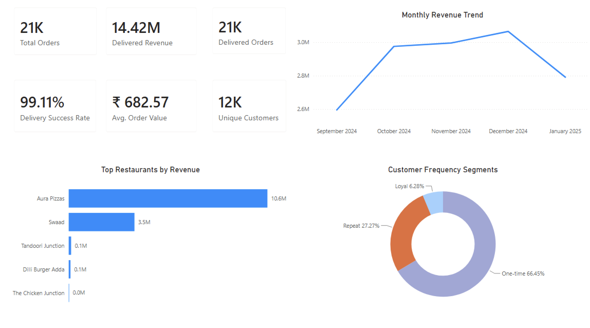
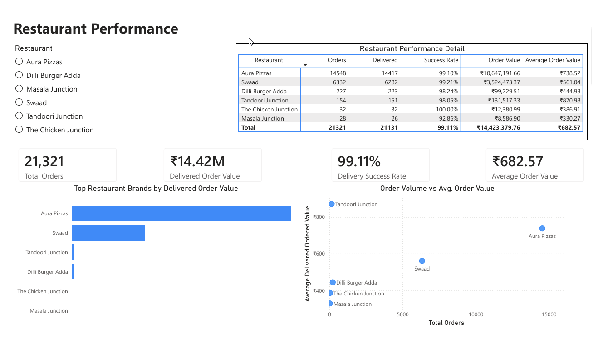

# Food Delivery Analytics Dashboard

## Project Overview

The **Food Delivery Analytics Dashboard** is an end-to-end analytics portfolio project that transforms raw food delivery operational data into an analytics-ready data model using PostgreSQL and SQL before producing business insights and interactive Power BI dashboards.

This project demonstrates a professional analytics workflow including data ingestion, profiling, cleaning, business analysis, documentation, version control, and dashboard development.

---

# Dataset Source and Geography

**Dataset:** Food Delivery Order History Dataset

**Source:** Kaggle

**Raw Table:** `raw_order_history`

**Clean Table:** `clean_orders`

**Geography Represented:** Delhi NCR

The dataset represents food delivery activity from **Delhi NCR**. All restaurant names, locations, and geographical information are preserved exactly as provided by the source dataset. No geographical information has been modified.

---

# Business Objectives

This project is designed to answer practical business questions such as:

- What is the overall delivery success rate?
- Which restaurant locations and brands generate the highest order volume?
- Which restaurant locations generate the highest delivered order value?
- What are the peak ordering hours and busiest days?
- Which operational metrics influence delivery performance?
- How complete and reliable is customer feedback?
- How do discounts, packaging charges, and final order totals affect financial analysis?
- How can raw operational data be transformed into an analytics-ready data model?

---

# Tech Stack

- PostgreSQL
- SQL
- DataGrip
- VS Code
- Git & GitHub
- Power BI (Dashboard Development)
- Python (Predictive Analytics & Machine Learning – Planned)

---

# Repository Structure

```text
docs/
│── data_dictionary.md
│── data_profiling_report.md
│── data_cleaning_report.md
│── business_analysis_report.md
│── advanced_sql_report.md
│── power_bi_dashboard_plan.md

sql/
│── 01_database_setup.sql
│── 02_data_profiling.sql
│── 03_data_cleaning.sql
│── 04_business_analysis.sql
│── 05_advanced_sql.sql

dashboard/
│── Food_Delivery_Analytics_Dashboard.pbix

images/
└── dashboard/
    ├── executive_dashboard_page_1.png
    └── restaurant_performance_page_2.png

notebooks/

data/
│── order_history_kaggle_data.csv

README.md
```

> The raw dataset is not committed to this repository. Download it from Kaggle and place it in the local `data/` directory.

---

# Project Workflow

```text
Kaggle Dataset
        │
        ▼
raw_order_history
        │
        ▼
Data Profiling
        │
        ▼
clean_orders
        │
        ▼
Business Analysis
        │
        ▼
Advanced SQL
        │
        ▼
Analytics Views
(`vw_executive_kpis`, `vw_monthly_performance`,
 `vw_restaurant_performance`, `vw_customer_segments`,
 `vw_operational_performance`)
        │
        ▼
Power BI Dashboard
```

---
# Project Architecture

Raw Layer
    raw_order_history

↓

Staging Layer
    clean_orders

↓

Analytics Layer
    Business SQL
    Analytics Views

↓

Visualization Layer
    Power BI

---

# Skills Demonstrated

This project demonstrates practical experience in:

- PostgreSQL Database Design
- SQL Data Cleaning
- Data Profiling
- Exploratory Data Analysis (EDA)
- Data Quality Assessment
- Analytics Engineering
- Business Metrics Development
- Git & GitHub
- Technical Documentation
- Common Table Expressions (CTEs)
- Window Functions
- Customer Segmentation
- Time-Series Analysis
- Analytics View Development
- Reusable Data Modeling for Power BI

---

# Current Progress

Completed:

- ✅ PostgreSQL database setup
- ✅ Raw data ingestion
- ✅ Data profiling
- ✅ Data quality assessment
- ✅ Data cleaning
- ✅ Analytics-ready staging layer (`clean_orders`)
- ✅ Business analysis
- ✅ Business analysis report
- ✅ Advanced SQL
- ✅ Analytics views
- ✅ Advanced SQL report
- ✅ Power BI dashboard plan
- ✅ Executive Dashboard Page 1
- ✅ Restaurant Performance Page 2

In progress:

- 🚧 Power BI Dashboard Pages 3–4

Upcoming:

- Final Documentation

---

# Key Profiling Findings

| Metric | Value |
|---------|-------:|
| Total Orders | 21,321 |
| Restaurant Locations | 21 |
| Restaurant Brands | 6 |
| Unique Customers | 11,607 |
| Cities | 1 (Delhi NCR) |
| Subzones | 8 |
| Rating Completion | 11.68% |
| Duplicate Order IDs | 0 |
| Date Range | 2024-09-01 → 2025-01-31 |
| Delivered Orders | 21,131 |
| Delivery Success Rate | 99.11% |
| Delivered Order Value | 14,423,379.76 |

---

# Power BI Dashboard

Power BI consumes the validated PostgreSQL analytics views as its semantic layer. PostgreSQL defines the reusable KPIs, monthly performance, restaurant performance, customer segments, and operational benchmarks. Power BI is used for visualization, interaction, and a limited set of presentation measures rather than duplicating core analytical logic.

The dashboard file is available at `dashboard/Food_Delivery_Analytics_Dashboard.pbix`.

## Dashboard Screenshots




## Completed Page 1: Executive Overview

The completed Executive Overview contains:

- Total Orders KPI: **21,321**
- Delivered Order Value KPI: **14,423,379.76**
- Delivered Orders KPI: **21,131**
- Delivery Success Rate KPI: **99.11%**
- Average Delivered Order Value KPI: **682.57**
- Unique Customers KPI: **11,607**
- Monthly Delivered Order Value Trend
- Top 5 Restaurants by Delivered Order Value
- Customer Frequency Segments: **One-time**, **Repeat**, and **Loyal**

The Delivery Success Rate presentation measure divides the SQL percentage value by 100 so Power BI displays `99.11%` with percentage formatting. Page 1 uses all-time executive KPIs; visuals sourced from disconnected views do not imply unsupported cross-filtering.

## Completed Page 2: Restaurant Performance

The Restaurant Performance page provides restaurant-level performance analysis using interactive filtering, KPIs, comparative visualizations, and detailed operational metrics.

The completed page contains:

- Restaurant list slicer
- KPI cards:
  - Total Orders
  - Delivered Order Value
  - Delivery Success Rate
  - Average Order Value
- Top Restaurant Brands by Delivered Order Value horizontal bar chart
- Order Volume vs Average Order Value scatter chart
- Restaurant Performance Detail matrix

The restaurant list slicer filters the Page 2 KPIs and visual comparisons. Metrics continue to use the validated PostgreSQL analytics views as the semantic layer, with Power BI providing presentation and interaction.

Pages 3–4 remain in progress:

- Customer Analysis
- Operational Performance

---

# Data Quality Notes

The project follows a layered architecture.

### Raw Layer (`raw_order_history`)

The raw ingestion table preserves the original dataset exactly as received from Kaggle.

Examples include:

- Text-formatted timestamps
- Text-formatted distance values
- Original restaurant information
- Original customer information

No transformations are applied to the raw table.

---

### Clean Layer (`clean_orders`)

The cleaned staging layer prepares the dataset for analysis by:

- Converting timestamps into PostgreSQL `TIMESTAMP`
- Converting distance into numeric kilometers
- Trimming whitespace
- Standardizing missing values
- Preserving the original raw data
- Creating an analytics-ready staging table

---

# Roadmap

- [x] Environment Setup
- [x] Data Profiling
- [x] Data Cleaning
- [x] Business Analysis
- [x] Advanced SQL
- [x] Power BI Dashboard Planning
- [x] Executive Dashboard Page 1
- [x] Restaurant Performance Page 2
- [ ] Customer Analysis Page 3
- [ ] Operational Performance Page 4
- [ ] Power BI Dashboard Finalization
- [ ] Final Documentation

---

# Future Improvements

Future versions of this project will include:

- Query performance tuning and analytics-view indexing strategy
- Complete the remaining Power BI dashboard pages
- Python-based customer segmentation
- Time-series forecasting
- Customer review sentiment analysis
- Automated ETL pipeline

---

# Author

**Yogesh Periyasamy**

Master of Computer Science

Building an end-to-end portfolio focused on Data Analytics, Business Intelligence, and Analytics Engineering.
